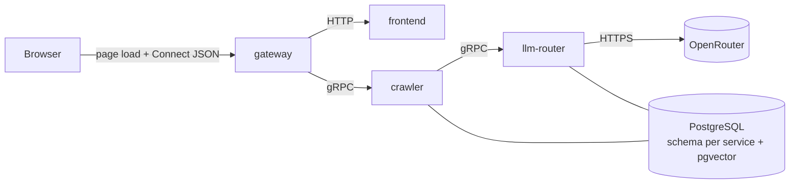

# AI Engineering Boilerplate

A Rust microservice boilerplate for AI products, built to go from code change to running service in seconds on a local machine. Prototyping now, scaling later: the code holds up in production, while infrastructure stays lean (one Postgres, Docker Compose, no Kafka or Kubernetes) until the product proves itself. Service boundaries are clean enough to move to the cloud later without a rewrite.

It ships with a crawler that indexes websites for semantic search, an LLM router that picks models by quality tier, and a set of code-review skills that AI agents run in parallel.

## Status

Early stage. Most of the system is specified but not yet built.

| Part | State |
|---|---|
| Cargo workspace and `common` crate, which generates Connect/gRPC stubs from `common/proto/` | Done |
| `frontend` service, which owns the web UI (`services/frontend/`) | Done |
| Code-review skills (`.agents/skills/code-review/`) | Done |
| `crawler` and `gateway` services, end to end over Connect + gRPC | Done — jobs persisted in `crawler.crawl_jobs`, idempotent `StartCrawl` |
| Docker Compose with hot reload | Done |
| Crawling with spider-rs: scope rules, page cap, live progress | Done |
| Postgres 18 + pgvector, one schema and role per service | Done |
| Crawler page storage: title, main text, and content hash in `crawler.pages` | Done |
| `llm-router` service: tier contract, fallback, request log | Done — crawler enrichment not wired yet |
| Enrichment, embeddings, search, `CacheStore` | Next |

## Architecture



- **Gateway** is the only service reachable from outside. It routes requests and holds no business logic; each service validates what it receives at its own API boundary.
- The browser loads the page and calls RPCs from the same origin, so there is no CORS anywhere in the system. Gateway proxies page routes to Frontend and answers every Connect path itself.
- Services talk to each other over gRPC only. Shared contracts live in `common/proto/`.
- Each service that stores data connects to Postgres with its own role, and that role can only access the service's own schema. Gateway stores nothing today; its schema and role are provisioned but empty. Postgres enforces the isolation — see [schema-isolation.md](.agents/skills/code-review/gate-database/schema-isolation.md).

## Stack

| Use | Tool |
|---|---|
| Language | Rust (edition 2024, 1.98+) |
| Inter-service | gRPC via [connectrpc](https://crates.io/crates/connectrpc) and [buffa](https://crates.io/crates/buffa), contracts in `common/proto/` |
| External API | Connect via Gateway ([axum](https://crates.io/crates/axum)) — proto-defined RPC callable from plain `fetch`, no REST |
| Database | PostgreSQL 18, one instance, schema per service, pgvector, through [SeaORM](https://crates.io/crates/sea-orm) entities |
| Cache | PostgreSQL behind the `CacheStore` trait in `common/cache/`, swappable for Redis later |
| LLM | [OpenRouter](https://openrouter.ai/), reached through the LLM Router |
| Runtime | Docker Compose, one Dockerfile per service, Alpine base with static musl binaries |

**Not now:** Redis, Kafka, Kubernetes, cloud tooling, a second database, heavy frameworks. Need a cache? Postgres behind `CacheStore`. Cloud scaling comes later, on top of this codebase — not inside it.

## Layout

```
.
├── Cargo.toml                    # workspace
├── compose.yaml                  # the whole stack: images, resource limits, Postgres bootstrap
├── common/                       # shared crate: proto contracts + generated stubs
├── services/
│   ├── crawler/                  # crawl, enrich, embed, search
│   ├── frontend/                 # web UI: pages, styles, client-side logic
│   ├── gateway/                  # public Connect API, proxies page routes to frontend
│   └── llm-router/               # LLM calls by quality tier, with fallback
└── .agents/skills/code-review/   # review gates for AI agents
```

## Services

| Service | What it does |
|---|---|
| [crawler](services/crawler/README.md) | Crawls sites with [spider-rs](https://github.com/spider-rs/spider), strips each page down to its main content, enriches it with an LLM, and stores embeddings for hybrid search. Unchanged pages are skipped before any paid LLM or embedding call. |
| [frontend](services/frontend/README.md) | Owns the entire web UI — markup, styles, and all client-side logic. Serves pages on the internal network only; the browser reaches them through Gateway. |
| [gateway](services/gateway/README.md) | The only service exposed to the host. Re-exposes `CrawlerService` over Connect so browsers can call it with plain `fetch`, forwards to internal services over gRPC, and proxies page routes to Frontend. |
| [llm-router](services/llm-router/README.md) | Callers ask for a `low`, `medium`, or `high` tier instead of a model name. The router maps each tier to a primary and backup model on OpenRouter. |

Shared code rules are in [common/README.md](common/README.md).

## Rules

Each rule is enforced by a code-review gate, which holds the details.

- **Structured logs** — every service writes one JSON line per event to stderr through `tracing`, with the crate name as `target`; nothing goes to stdout.
- **Self-documenting code, no comments** — names carry the meaning; a one-line summary at the top of a file is the only comment. [gate-code-quality](.agents/skills/code-review/gate-code-quality/SKILL.md)
- **Check input once, at the entry** — every outside value is validated where it enters and every size has a named limit, so the code behind the entry stays thin. [gate-code-quality](.agents/skills/code-review/gate-code-quality/SKILL.md#boundaries-and-limits)
- **Fix bugs at their origin** — never with a new condition for the one reported case. [gate-bug-fix](.agents/skills/code-review/gate-bug-fix/SKILL.md)
- **One service per capability**, in `services/<name>/`, talking to other services over gRPC only. [gate-architecture](.agents/skills/code-review/gate-architecture/SKILL.md)
- **Callers see what, not how** — a contract exposes the capability, never the storage layout, library type, or vendor behind it. [gate-architecture](.agents/skills/code-review/gate-architecture/SKILL.md#contracts)
- **No workarounds** — every tool is used the way its official docs describe, so no shell scripts around `docker compose` or `cargo`. [gate-facts](.agents/skills/code-review/gate-facts/SKILL.md#documented-way-not-a-workaround)
- **Entities drive the schema** — sync on startup in dev, migration files for prod. Schema isolation enforced by Postgres roles, the smallest correct column type, ORM only, no logs or permanent raw HTML in the database. [gate-database](.agents/skills/code-review/gate-database/SKILL.md)
- **Tests are meaningful, fast, and reliable** — parallel, no network in unit tests, the whole suite under 2 minutes. [gate-testing](.agents/skills/code-review/gate-testing/SKILL.md)

## Working in Parallel

The layout exists so that several people or AI agents can each own one service at a time without merge conflicts. One task touches one `services/<name>/` folder; the shared files (`common/proto/`, workspace `Cargo.toml`, `compose.yaml`, `.env.example`, this README) each have an ownership rule in [gate-architecture](.agents/skills/code-review/gate-architecture/SKILL.md#parallel-work). A service builds, tests, and runs alone:

```bash
cargo nextest run -p crawler       # this service's tests only
docker compose up crawler          # this service plus what it depends on
```

Proto contracts change additively, so a service can ship a new field before any caller reads it, and callers upgrade on their own schedule.

## Code Review Skills

Agent skills live in `.agents/skills/`, grouped by purpose, and work in both Claude Code and Codex. Code review is the first group: a review runs its gates in parallel, one agent per gate, and each gate reports how long it took so the slowest one can be optimized. Start with [SKILL.md](.agents/skills/code-review/SKILL.md), which lists every gate.

## Getting Started

Running the stack needs only Docker with Compose v2.23 or newer, the version that reads the Postgres bootstrap `compose.yaml` carries inline. Nothing runs through a wrapper script: every command below is the tool's own, as its documentation describes.

```bash
git clone https://github.com/er-zhi/ai-engineering-boilerplate.git
cd ai-engineering-boilerplate
cp .env.example .env   # then replace the change-me passwords (openssl rand -hex 24) and set OPENROUTER_API_KEY
docker compose up
```

Compose refuses to start while `OPENROUTER_API_KEY` is unset, and LLM Router exits at startup if the key is not valid. Then open <http://localhost:8080> for the web UI. Only Gateway is published to the host; Crawler, Frontend, and LLM Router stay on the internal network, and Postgres is published on `127.0.0.1` alone.

While developing, start the same stack with [Compose Watch](https://docs.docker.com/compose/how-tos/file-watch/):

```bash
docker compose up --watch
```

Saving a file rebuilds that service's image and replaces its container. Development and production run the very same image, under the resource limits `compose.yaml` sets for every service.

### Database

In dev, Postgres listens on `127.0.0.1:5432`, never on the network. Connect any client (psql, the Database Client extension in VS Code or Cursor, DBeaver) with:

| Setting | Value |
|---|---|
| Server type | PostgreSQL |
| Host | `127.0.0.1` |
| Port | `5432` |
| Database | `app` |
| Username | `postgres` (superuser), or `crawler_user` / `llm_router_user` to see exactly what one service sees (`gateway_user` exists too, but its schema holds no tables yet) |
| Password | the matching value from `.env` |

The `postgres-bootstrap` config in `compose.yaml` creates the schemas and roles only on the first start, when the `pgdata` volume is empty. To apply changed passwords, remove that volume (`docker volume ls | grep pgdata`, then `docker volume rm <name>`), which deletes all data.

### Tests

```bash
cargo nextest run --workspace
```

This is the standard [cargo-nextest](https://nexte.st/) runner; `cargo test --workspace` also works, without per-test timing. It needs Rust 1.98+ and `protoc` (see below), plus a running Docker: the storage tests start their own Postgres through testcontainers.

### On the Host

The services also run outside Docker. You need Rust 1.98+ and `protoc` on your `PATH`, which `connectrpc-build` uses to compile the proto files (`brew install protobuf` on macOS, `apt install protobuf-compiler` on Debian/Ubuntu). Keep Postgres in Compose and start each service in its own terminal:

```bash
docker compose up -d postgres
DATABASE_URL=postgres://crawler_user:<CRAWLER_DB_PASSWORD>@127.0.0.1:5432/app cargo run -p crawler
cargo run -p frontend
cargo run -p gateway
OPENROUTER_API_KEY=<key> DATABASE_URL=postgres://llm_router_user:<LLM_ROUTER_DB_PASSWORD>@127.0.0.1:5432/app cargo run -p llm-router
```

Replace the placeholders with the values from `.env`; LLM Router also reads the `LLM_<TIER>_PRIMARY` / `LLM_<TIER>_BACKUP` variables listed there. Gateway finds Crawler and Frontend on `127.0.0.1:8081` and `127.0.0.1:8082` by default; LLM Router listens on `8083`.

### Calling the API

Calling an RPC takes no client library — the Connect protocol is a `POST` with a JSON body:

```bash
curl -X POST localhost:8080/crawler.v1.CrawlerService/StartCrawl \
  -H 'content-type: application/json' -H 'connect-protocol-version: 1' \
  -d '{"baseUrl":"https://example.com","scope":{"excludePatterns":["*/admin/*"]}}'
```
