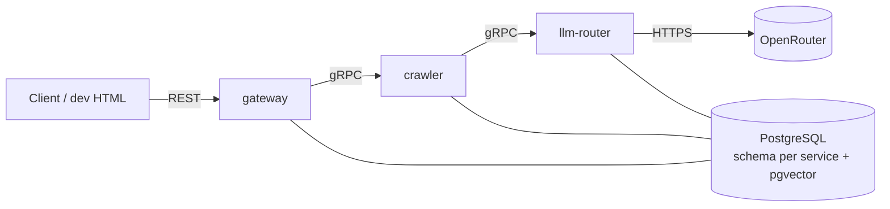

# AI Engineering Boilerplate

A Rust microservice boilerplate for AI products, built to go from code change to running service in seconds on a local machine. Infrastructure stays lean (one Postgres, Docker Compose, no Kafka or Kubernetes) until the product proves itself, and the service boundaries are clean enough to move to the cloud later without a rewrite.

It ships with a crawler that indexes websites for semantic search, an LLM router that picks models by quality tier, and a set of code-review skills that AI agents run in parallel.

## Status

Early stage. Most of the system is specified but not yet built.

| Part | State |
|---|---|
| Cargo workspace and `common` crate, which generates Connect/gRPC stubs from `common/proto/` | Done |
| Gateway dev client (`services/gateway/client/index.html`) | Done |
| Code-review skills (`skills/code-review/`) | Done |
| `crawler`, `gateway`, `llm-router` services | Specified in their READMEs |
| Docker Compose, Postgres schemas, `CacheStore` | Planned |

## Architecture



- **Gateway** is the only service reachable from outside. It validates input and routes requests; it holds no business logic.
- Services talk to each other over gRPC only. Shared contracts live in `common/proto/`.
- Each service connects to Postgres with its own role, and that role can only access the service's own schema. Postgres enforces the isolation.

## Stack

| Use | Tool |
|---|---|
| Language | Rust (edition 2021, 1.88+) |
| Inter-service | gRPC via [connectrpc](https://crates.io/crates/connectrpc) and [buffa](https://crates.io/crates/buffa) |
| External API | REST via Gateway ([axum](https://crates.io/crates/axum)) |
| Database | PostgreSQL, one instance, schema per service, pgvector |
| Cache | PostgreSQL behind a `CacheStore` trait, swappable for Redis later |
| LLM | [OpenRouter](https://openrouter.ai/), reached through the LLM Router |
| Runtime | Docker Compose, one Dockerfile per service |

See [goal.md](goal.md) for the full rules on dev velocity, data, and testing.

## Layout

```
.
├── Cargo.toml            # workspace
├── goal.md               # goals, stack, rules
├── common/               # shared crate: proto contracts + generated stubs
├── services/
│   ├── crawler/          # crawl, enrich, embed, search
│   ├── gateway/          # public REST API + dev client
│   └── llm-router/       # LLM calls by quality tier, with fallback
└── skills/code-review/   # review gates for AI agents
```

## Services

| Service | What it does |
|---|---|
| [crawler](services/crawler/README.md) | Crawls sites with [spider-rs](https://github.com/spider-rs/spider), strips each page down to its main content, enriches it with an LLM, and stores embeddings for hybrid search. Unchanged pages are skipped before any paid LLM or embedding call. |
| [gateway](services/gateway/README.md) | Public REST API (`/api/crawl`, `/api/search`), routes to internal services, serves the dev HTML client. |
| [llm-router](services/llm-router/README.md) | Callers ask for a `low`, `medium`, or `high` tier instead of a model name. The router maps each tier to a primary and backup model on OpenRouter. |

Shared code rules are in [common/README.md](common/README.md).

## Code Review Skills

`skills/code-review/` holds agent skills that work in both Claude Code and Codex. A review runs up to eight gates in parallel, one agent per gate, and each gate reports how long it took so the slowest one can be optimized.

| Gate | Checks |
|---|---|
| [architecture](skills/code-review/gate-architecture/SKILL.md) | Service boundaries, Docker, schema isolation |
| [code-quality](skills/code-review/gate-code-quality/SKILL.md) | Durability, naming, minimalism |
| [common](skills/code-review/gate-common/SKILL.md) | Type chain, shared code |
| [database](skills/code-review/gate-database/SKILL.md) | Column types, storage rules |
| [testing](skills/code-review/gate-testing/SKILL.md) | Runs the suite, reports failures and slow tests |
| [facts](skills/code-review/gate-facts/SKILL.md) | External claims checked against official docs |
| [evidence](skills/code-review/gate-evidence/SKILL.md) | Proof the change actually ran |
| [second-opinion](skills/code-review/gate-second-opinion/SKILL.md) | Independent review from other models |

Start with [skills/code-review/SKILL.md](skills/code-review/SKILL.md).

## Getting Started

Requires Rust 1.88 or newer and `protoc` on your `PATH`, which `connectrpc-build` uses to compile the proto files (`brew install protobuf` on macOS, `apt install protobuf-compiler` on Debian/Ubuntu).

```bash
git clone https://github.com/er-zhi/ai-engineering-boilerplate.git
cd ai-engineering-boilerplate
cargo build
```

`cargo build` compiles the `common` crate and generates Rust types from `common/proto/crawler.proto`. Once the services and Compose file land, `docker compose up` will bring up the full stack.
