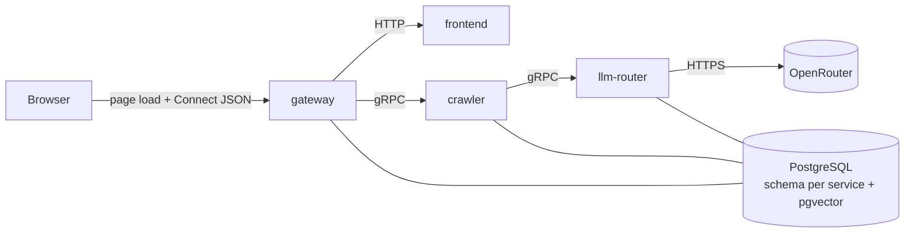

# AI Engineering Boilerplate

A Rust microservice boilerplate for AI products, built to go from code change to running service in seconds on a local machine. Infrastructure stays lean (one Postgres, Docker Compose, no Kafka or Kubernetes) until the product proves itself, and the service boundaries are clean enough to move to the cloud later without a rewrite.

It ships with a crawler that indexes websites for semantic search, an LLM router that picks models by quality tier, and a set of code-review skills that AI agents run in parallel.

## Status

Early stage. Most of the system is specified but not yet built.

| Part | State |
|---|---|
| Cargo workspace and `common` crate, which generates Connect/gRPC stubs from `common/proto/` | Done |
| `frontend` service, which owns the web UI (`services/frontend/`) | Done |
| Code-review skills (`.agents/skills/code-review/`) | Done |
| `crawler` and `gateway` services, end to end over Connect + gRPC | Done — job tracking is in memory |
| Docker Compose with hot reload | Done |
| Crawling with spider-rs: scope rules, page cap, live progress | Done — page counts only, nothing stored |
| Postgres schemas, page storage, enrichment, embeddings, `CacheStore` | Next |
| `llm-router` service | Specified in its README |

## Architecture



- **Gateway** is the only service reachable from outside. It validates input and routes requests; it holds no business logic.
- The browser loads the page and calls RPCs from the same origin, so there is no CORS anywhere in the system. Gateway proxies page routes to Frontend and answers every Connect path itself.
- Services talk to each other over gRPC only. Shared contracts live in `common/proto/`.
- Each service connects to Postgres with its own role, and that role can only access the service's own schema. Postgres enforces the isolation.

## Stack

| Use | Tool |
|---|---|
| Language | Rust (edition 2024, 1.98+) |
| Inter-service | gRPC via [connectrpc](https://crates.io/crates/connectrpc) and [buffa](https://crates.io/crates/buffa) |
| External API | Connect via Gateway ([axum](https://crates.io/crates/axum)) — proto-defined RPC callable from plain `fetch` |
| Database | PostgreSQL, one instance, schema per service, pgvector |
| Cache | PostgreSQL behind a `CacheStore` trait, swappable for Redis later |
| LLM | [OpenRouter](https://openrouter.ai/), reached through the LLM Router |
| Runtime | Docker Compose, one Dockerfile per service, Alpine base with static musl binaries |

See [goal.md](goal.md) for the full rules on dev velocity, data, and testing.

## Layout

```
.
├── Cargo.toml            # workspace
├── goal.md               # goals, stack, rules
├── common/               # shared crate: proto contracts + generated stubs
├── services/
│   ├── crawler/          # crawl, enrich, embed, search
│   ├── frontend/         # web UI: pages, styles, client-side logic
│   ├── gateway/          # public Connect API, proxies page routes to frontend
│   └── llm-router/       # LLM calls by quality tier, with fallback
└── .agents/skills/code-review/   # review gates for AI agents
```

## Services

| Service | What it does |
|---|---|
| [crawler](services/crawler/README.md) | Crawls sites with [spider-rs](https://github.com/spider-rs/spider), strips each page down to its main content, enriches it with an LLM, and stores embeddings for hybrid search. Unchanged pages are skipped before any paid LLM or embedding call. |
| [frontend](services/frontend/README.md) | Owns the entire web UI — markup, styles, and all client-side logic. Serves pages on the internal network only; the browser reaches them through Gateway. |
| [gateway](services/gateway/README.md) | The only service exposed to the host. Re-exposes `CrawlerService` over Connect so browsers can call it with plain `fetch`, forwards to internal services over gRPC, and proxies page routes to Frontend. |
| [llm-router](services/llm-router/README.md) | Callers ask for a `low`, `medium`, or `high` tier instead of a model name. The router maps each tier to a primary and backup model on OpenRouter. |

Shared code rules are in [common/README.md](common/README.md).

## Code Review Skills

`.agents/skills/code-review/` holds agent skills that work in both Claude Code and Codex. A review runs up to eight gates in parallel, one agent per gate, and each gate reports how long it took so the slowest one can be optimized.

| Gate | Checks |
|---|---|
| [architecture](.agents/skills/code-review/gate-architecture/SKILL.md) | Service boundaries, Docker, schema isolation |
| [code-quality](.agents/skills/code-review/gate-code-quality/SKILL.md) | Durability, naming, minimalism |
| [common](.agents/skills/code-review/gate-common/SKILL.md) | Type chain, shared code |
| [database](.agents/skills/code-review/gate-database/SKILL.md) | Column types, storage rules |
| [testing](.agents/skills/code-review/gate-testing/SKILL.md) | Runs the suite, reports failures and slow tests |
| [facts](.agents/skills/code-review/gate-facts/SKILL.md) | External claims checked against official docs |
| [evidence](.agents/skills/code-review/gate-evidence/SKILL.md) | Proof the change actually ran |
| [second-opinion](.agents/skills/code-review/gate-second-opinion/SKILL.md) | Independent review from other models |

Start with [.agents/skills/code-review/SKILL.md](.agents/skills/code-review/SKILL.md).

## Getting Started

Requires Rust 1.98 or newer and `protoc` on your `PATH`, which `connectrpc-build` uses to compile the proto files (`brew install protobuf` on macOS, `apt install protobuf-compiler` on Debian/Ubuntu).

```bash
git clone https://github.com/er-zhi/ai-engineering-boilerplate.git
cd ai-engineering-boilerplate
docker compose up
```

Then open <http://localhost:8080> for the web UI. Compose picks up `docker-compose.override.yml` automatically, which mounts the source and runs `watchexec`, so a save rebuilds and restarts only the service whose code (or `common/`) changed. Only Gateway is published to the host; Crawler and Frontend stay on the internal network.

To work without Docker you need Rust 1.98+ and `protoc`, then `cargo build` and run the three binaries, pointing Gateway at the other two:

```bash
./target/debug/crawler &
./target/debug/frontend &
CRAWLER_URL=http://127.0.0.1:8081 FRONTEND_URL=http://127.0.0.1:8082 ./target/debug/gateway
```

Calling an RPC takes no client library — the Connect protocol is a `POST` with a JSON body:

```bash
curl -X POST localhost:8080/crawler.v1.CrawlerService/StartCrawl \
  -H 'content-type: application/json' -H 'connect-protocol-version: 1' \
  -d '{"baseUrl":"https://example.com","scope":{"excludePatterns":["*/admin/*"]}}'
```
