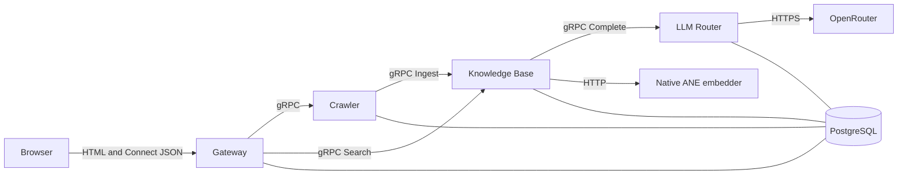

# Architecture

This document owns cross-service boundaries and data flow. Service-specific behavior belongs in each service README; wire shapes belong in `common/proto/`; database fields belong in the owning service's entities.

## Runtime Flow



Gateway is the only application service published to the host. It serves Frontend's static output and translates public Connect calls into internal gRPC calls. The browser therefore uses one origin and needs no CORS configuration.

Crawler fetches and denoises pages, stores its crawl record, and submits each successfully stored page to Knowledge Base. Knowledge Base hashes content independently and skips enrichment and embedding when its own stored hash is unchanged. This makes Knowledge Base authoritative for its costs and allows a previously failed hand-off to succeed on a later crawl.

Knowledge Base calls LLM Router for enrichment and the native embedder for document and query vectors. Search combines semantic and lexical passage retrieval and returns evidence; answer generation remains the caller's responsibility.

## Boundaries

- Rust services communicate through contracts in `common/proto/`, not through shared tables, files, or internal modules.
- Each persistent service owns one PostgreSQL schema and connects with a role restricted to it. See [schema isolation](../.agents/skills/code-review/gate-database/schema-isolation.md).
- `common` contains wire contracts and code already shared by multiple services, not business logic or repositories.
- Frontend is a one-shot build container. It copies static files to a volume that Gateway mounts read-only; it is not a runtime server or Cargo workspace member.
- `native/embedder-ane` is the only host-native component. Core ML has no Linux-container equivalent, so Knowledge Base reaches it through `host.docker.internal`.
- Provider credentials exist only in LLM Router. Callers request a quality tier for completion, or send typed questions for a decision, and never choose a provider or model slug.

## Repository Layout

```text
common/                     shared Rust contracts and utilities
services/crawler/           crawl jobs, pages, and link graph
services/knowledge-base/    enrichment, embeddings, and retrieval
services/llm-router/        tier routing, fallback, structured decisions, and request audit
services/gateway/           authentication, public API, static serving
services/frontend/          browser files copied into Gateway's volume
native/embedder-ane/        host-native Core ML embedding process
.agents/skills/code-review/ automated review gates
```

## Current Constraints

- The stack targets local Apple Silicon development because the embedder uses the Neural Engine.
- Schema synchronization is convenient for development but is not a production migration system.
- Crawl-to-Knowledge-Base delivery has no durable retry queue; a later successful crawl retries the hand-off.
- Any future durable job queue must sit behind a service-owned `Queue` or `JobQueue` trait so domain code depends only on that abstraction. Its first adapter should use the owning service's PostgreSQL schema; SQS, RabbitMQ, or another broker may replace that adapter later without entering business logic.
- One PostgreSQL instance and Docker Compose are intentional until scale measurements require more infrastructure.
- Tables that grow with time rather than with entities (events, audit, usage) are date-partitioned from their first version; hot worker tables hold only live rows. Rationale and reviewer checklist: [gate-database](../.agents/skills/code-review/gate-database/SKILL.md#growth-hot-tables-and-unbounded-tables).
