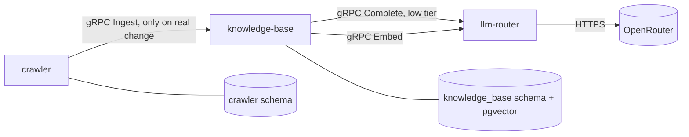

# Knowledge Base Service — Design Spec

## Goal

A new `knowledge-base` service that stores what crawler (and later, other sources) produce: content, an LLM-derived `page_type`/`keywords`/`summary`, and an embedding, in one place searchable later by similarity and by keyword/type filters. Crawler stops being the only place enriched, embedded content can end up.

## Why a Separate Service

"One service per capability" already governs this repo. Crawling and knowledge storage/retrieval are different capabilities with different lifecycles — a second source (a document upload, another crawler, a manual import) should be able to feed the same store without going through crawler's code. Splitting them now, while there is exactly one caller, costs little and avoids a later untangling.

## Content Ownership

Crawler keeps storing full content in `crawler.pages` exactly as it does today (`url`, `title`, `main_text`, `content_hash`, `http_status`, `crawled_at`) — this is crawler's own record, used for its own dedup and, later, its own revisit/skip-ladder logic. Nothing about that table changes.

Knowledge-base does **not** trust a caller's dedup claim. It hashes the content it receives itself and upserts by `(source, source_id)`, so a second source that skips its own dedup, or a caller that gets it wrong, cannot corrupt the store.

## Data Flow



1. Crawler crawls, denoises, hashes — unchanged.
2. `PageStore::save` reports whether the row was new or its content hash changed from the previously stored row (it already reads the existing row to upsert; it now also compares hashes before writing). This is crawler's own skip check, matching the already-documented "denoised hash unchanged ends the work before any spend."
3. Only on a real change, crawler's store loop calls `knowledge-base.Ingest` over gRPC. The contract is source-agnostic (`source`, `source_id`, `title`, `content`) rather than shaped around crawler specifically, so a second source can call it later without a new RPC.
4. Knowledge-base's `Ingest` handler:
   - Hashes `content` itself; if a document already exists for `(source, source_id)` with the same hash, updates `updated_at` only and returns — no LLM or embedding spend.
   - Otherwise calls `llm-router.Complete` (`low` tier) with a prompt asking for `page_type` (one of `product`, `knowledge`, `instruction`, `documentation`, `blog`, `other` — the same list already specified for crawler), `keywords` (free-form list), and `summary`, as a JSON object (`response_format: json_object`).
   - Calls `llm-router.Embed` with `content` to get the vector.
   - Upserts `knowledge_base.documents`.
5. Search (pgvector similarity + keyword/type filters) is the natural next step on this schema but is **out of scope** for this slice — same status crawler's own Search already has.

## Proto: `knowledge_base.proto` (new)

```protobuf
service KnowledgeBaseService {
  rpc Ingest(IngestRequest) returns (IngestResponse);
}

message IngestRequest {
  string source = 1;      // e.g. "crawler"
  string source_id = 2;   // e.g. the crawled URL
  string title = 3;
  string content = 4;
}

message IngestResponse {
  bool stored = 1;
  bool skipped = 2;   // true when the content hash matched an existing document
}
```

## Proto: `llm_router.proto` (extended)

```protobuf
service LlmRouterService {
  rpc Complete(CompleteRequest) returns (CompleteResponse);
  rpc DescribeTiers(DescribeTiersRequest) returns (DescribeTiersResponse);
  rpc Embed(EmbedRequest) returns (EmbedResponse);
}

message EmbedRequest {
  string input = 1;
}

message EmbedResponse {
  repeated float embedding = 1;
  string model_used = 2;
  int32 tokens_in = 3;
}
```

## Embedding Model: One Primary, No Backup

Verified live against OpenRouter:

| Model | Vendor | Dimensions | Works |
|---|---|---|---|
| `openai/text-embedding-3-small` | OpenAI | 1536 | Yes |
| `google/gemini-embedding-001` | Google | 3072 | Yes |
| `qwen/qwen3-embedding-8b` | Alibaba | 4096 | Yes |

Unlike chat completions, a fallback to a different vendor is **not** safe here: embedding vectors from different models live in different, incompatible vector spaces — cosine similarity between a 1536-dim OpenAI vector and a 3072-dim Google vector is meaningless, and pgvector's `vector(N)` column is fixed-dimension besides. Automatic fallback would either fail to insert (dimension mismatch) or silently corrupt search relevance for whichever rows used the backup.

`Embed` therefore has **one configured model**, no fallback: `EMBEDDING_MODEL` env var, default `openai/text-embedding-3-small`. A transient failure is a normal RPC error, and `Ingest` stays all-or-nothing (see Error Handling) rather than writing a document with no embedding. Revisit multi-model support (e.g., a `model_version` column and per-model similarity search) only if real reliability data justifies the complexity.

Adapter reuse: `openai_compatible` already speaks OpenRouter's OpenAI-compatible API on the same base URL and key; `Embed` adds one more HTTP path (`/embeddings`) on the same `OpenAiCompatible` client, no new provider type.

## Schema (`knowledge_base`)

```
documents
  id            bigserial, primary key
  source        varchar(64)    not null
  source_id     varchar(2048)  not null
  title         varchar(512)   not null   (empty string when the source has none)
  content       text           not null
  content_hash  char(64)       not null
  page_type     smallint       not null   (enum discriminant of the page-type list above, per gate-database)
  keywords      varchar(64)[]  not null   (count capped at the Ingest boundary)
  summary       text           not null
  embedding     vector(1536)   not null
  embedding_model varchar(128) not null   (so a future dimension change is detectable per row)
  ingested_at   timestamptz    not null
  updated_at    timestamptz    not null
  unique(source, source_id)
```

No pgvector index (HNSW/IVFFlat) in this slice; it arrives with Search. Entity-first, synced on startup like every other service's schema. `knowledge_base_user` owns the schema; no other service's role can read or write it. This slice adds the `knowledge_base` / `knowledge_base_user` / `KNOWLEDGE_BASE_DB_PASSWORD` row to `schema-isolation.md`, the matching lines to `postgres-bootstrap` in `compose.yaml`, the key to `.env.example`, and a `DATABASE_URL` for the new service.

## Error Handling

- `Ingest` on an empty `content` or `source`/`source_id`, or a `source_id` over 2048 characters or `title` over 512: `invalid_argument`, checked once at the entry.
- A `Complete` or `Embed` failure during ingest: the RPC returns an error to crawler; the document is not partially written (no row with enrichment but no embedding, or vice versa) — either the whole ingest succeeds or nothing is written beyond what was already there.
- Crawler's store loop treats a failed `Ingest` call the same way it already treats a failed `PageStore::save`: log to stderr, keep going, don't fail the job.
- Known limitation of this slice: crawler decides whether to call `Ingest` from its **own** stored hash, not knowledge-base's. If `Ingest` fails, crawler's own row is already written, so an unchanged re-crawl will not retry the ingest — only a further content change will. No durable retry queue exists yet; this is an accepted gap, not a bug, until real failure rates justify one.

## Testing

- Knowledge-base: unit tests for hash-based dedup and JSON-parsing of the enrichment response against fake `Provider`/`Embedder` doubles — no network. Integration tests against testcontainers Postgres for the upsert and schema.
- `Embed` on the `OpenAiCompatible` adapter: same local-HTTP-stub pattern already used for `Complete`'s tests — a fake `/embeddings` endpoint, not real OpenRouter, in the automated suite.
- Crawler: unit test that a real content change triggers a call to a fake knowledge-base client, and an unchanged hash does not.
- One manual live call (real OpenRouter) excluded from the normal run, same as `llm-router`'s existing pattern, to confirm the real `/embeddings` shape without paying for it on every test run.

## Out of Scope for This Slice

- Search (pgvector similarity + filters) on `knowledge_base.documents`.
- Batch ingestion or batch embedding.
- A second embedding model / model_version-partitioned search.
- Any source other than crawler actually calling `Ingest` — the contract is shaped to allow it, not to serve it yet.
