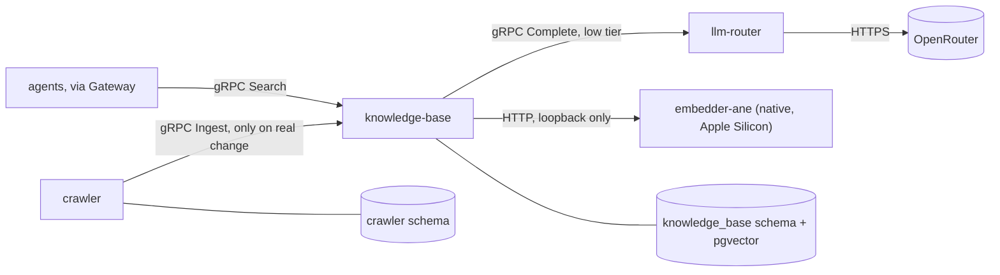

# Knowledge Base Service — Design Spec

## Goal

A `knowledge-base` service that stores what crawler (and later, other sources) produce — content, an LLM-derived `page_type`/`keywords`/`summary`, and embedded passages — and serves hybrid retrieval over it to other services, typically AI agents, which write any answer themselves. Crawler stops being the only place enriched, embedded content can end up.

## Why a Separate Service

"One service per capability" already governs this repo. Crawling and knowledge storage/retrieval are different capabilities with different lifecycles — a second source (a document upload, another crawler, a manual import) should be able to feed the same store without going through crawler's code. Splitting them now, while there is exactly one caller, costs little and avoids a later untangling.

## Content Ownership

Crawler keeps storing full content in `crawler.pages` exactly as it does today (`url`, `title`, `main_text`, `content_hash`, `http_status`, `crawled_at`) — this is crawler's own record, used for its own dedup and, later, its own revisit/skip-ladder logic. Nothing about that table changes.

Knowledge-base does **not** trust a caller's dedup claim. It hashes the content it receives itself and upserts by `(source, source_id)`, so a second source that skips its own dedup, or a caller that gets it wrong, cannot corrupt the store.

## Data Flow



1. Crawler crawls, denoises, hashes — unchanged.
2. `PageStore::save` reports whether the row was new or its content hash changed from the previously stored row (it already reads the existing row to upsert; it now also compares hashes before writing). This is crawler's own skip check, matching the already-documented "denoised hash unchanged ends the work before any spend."
3. Only on a real change, crawler's store loop calls `knowledge-base.Ingest` over gRPC. The contract is source-agnostic (`source`, `source_id`, `title`, `content`) rather than shaped around crawler specifically, so a second source can call it later without a new RPC.
4. Knowledge-base's `Ingest` handler:
   - Hashes `content` itself; if a document already exists for `(source, source_id)` with the same hash, updates `updated_at` only and returns — no LLM or embedding spend.
   - Otherwise calls `llm-router.Complete` (`low` tier) with a prompt asking for `page_type` (one of `product`, `knowledge`, `instruction`, `documentation`, `blog`, `other` — the same list already specified for crawler), `keywords` (free-form list), and `summary`, as a JSON object (`response_format: json_object`).
   - Splits `content` into passages and embeds each, with a title-and-summary header, by calling the native `embedder-ane` process over loopback HTTP — no provider credential, no OpenRouter; see [Embedding Model](#embedding-model-native-apple-silicon-only) and [Search](#search).
   - Writes `knowledge_base.documents` and `knowledge_base.document_chunks` in one transaction.
5. `Search`, reached through Gateway, retrieves over the passages — see [Search](#search).

## Proto: `knowledge_base.proto`

The current contract is [`common/proto/knowledge_base.proto`](../../common/proto/knowledge_base.proto): `Ingest(source, source_id, title, content) -> (stored, skipped)`, `Search(query, page_types, limit) -> results[]` with a best-matching `snippet` and `updated_at` per document. `Ingest` is source-agnostic (`source` e.g. `"crawler"`, `source_id` e.g. the crawled URL) so a second source needs no new RPC.

## Embedding Model: Native, Apple Silicon Only

Embedding does not go through llm-router, OpenRouter, or any provider credential. Knowledge-base calls [`native/embedder-ane`](../../native/embedder-ane/README.md) — a separate process running [`Qwen/Qwen3-Embedding-0.6B`](https://huggingface.co/Qwen/Qwen3-Embedding-0.6B) on the Apple Neural Engine through Core ML — over loopback HTTP.

This went through four iterations before landing here, each resolving a real constraint the last one hit:

1. **Remote (OpenRouter `text-embedding-3-small`)** — the original design. Works anywhere, but a query embedded over the internet costs a round trip on every single search, and Search is the one path in this system that is latency-sensitive in a way `Ingest` (a background crawl) is not.
2. **Local, in-process, CPU (`all-MiniLM-L6-v2` via `candle`)** — removed the network round trip entirely, and was chosen small (22.7M parameters, 384 dimensions) specifically to keep CPU inference fast without a GPU. Verified to build on Alpine/musl where `ort`/`fastembed` (the more common local-embedding choice) cannot: an actual build against this repo's own `rust:1.98-alpine3.24` image failed with `ort-sys@2.0.0-rc.13: no prebuilt binaries available for target aarch64-unknown-linux-musl` (and the same on `x86_64-unknown-linux-musl`), while `candle` — pure Rust plus the `gemm` BLAS-equivalent crate — built cleanly on the same image. This stage's real limitation: the whole team develops on Apple Silicon Macs, and "smallest CPU-friendly model" was a worse trade than it needed to be once GPU access was actually considered.
3. **Native, GPU (`candle` on Metal — since removed)** — since every developer's machine is an Apple Silicon Mac (M1 or newer) with a Metal GPU, and Docker containers cannot reach it (Metal has no Linux/container equivalent, and OrbStack does not pass the GPU through to containers), the fix is to run the embedder as a plain process on the host instead of inside the container. `knowledge-base`'s container reaches it over `host.docker.internal`, which OrbStack and Docker Desktop both support. A loopback HTTP call costs microseconds, so stage 1's original latency problem does not reappear — only stage 2's model-size ceiling does, and a GPU removes that ceiling: model quality became the only thing to optimize for, which is why the model changed from a 22.7M-parameter BERT encoder to a 600M-parameter one. Measured: ~190 ms a call, and PyTorch's MPS backend measured the same — at batch size one this model is GPU-memory-bandwidth-bound, so no GPU framework does better.
4. **Native, Neural Engine (`embedder-ane`, current)** — 190 ms is a fixed cost per search that was too visible. The Neural Engine is a different accelerator from the GPU, reached only through Core ML, which needs a fixed-shape compiled graph rather than the dynamic-shape decoder `candle` runs. A published Core ML conversion of the same model ([`neuradex/Qwen3-Embedding-0.6B-CoreML-ANE`](https://huggingface.co/neuradex/Qwen3-Embedding-0.6B-CoreML-ANE), two graphs: 128- and 512-token) measured 24.6 ms; 8-bit weight quantization with `coremltools` brought that to 18.6 ms at cosine similarity 0.999 to the unquantized output. 6-bit was no faster and slightly worse; 4-bit destroyed the embeddings (cosine 0.5–0.6). Smaller encoder models (`bge-small`/`base`/`large`, re-implemented for the Neural Engine by Apple's `ml-ane-transformers` recipe) reached 1.5–12 ms but at lower retrieval quality; the same model as stage 3, ten times faster, was the better trade. The cost is portability: Core ML is macOS-only. Stage 3's `candle` implementation was kept for a while as a portable fallback and then deleted — two embedders whose vectors were never verified to match was a liability, not a fallback. A future Linux host means re-implementing the embedder (the same weights run on CUDA via `candle` or PyTorch) and re-embedding every document.

**Why `Qwen3-Embedding-0.6B`:** Apache-2.0, native `candle` support (`candle_transformers::models::qwen3`), 1024-dimensional output with Matryoshka truncation down to 32 dimensions without retraining (so a future move to a smaller vector is a config change, not a model swap), and a 32,768-token context that makes the truncation problem stage 2 had effectively disappear for real crawled pages. It is decoder-only (`Qwen3ForCausalLM`), not the encoder-only BERT shape smaller embedding models use — last-token pooling instead of mean pooling, and an instruction prefix on queries only (the model's own documented usage pattern for asymmetric retrieval) — see [`embedder-ane`'s README](../../native/embedder-ane/README.md#model).

Fallback across embedding models was never sound, remote or local: vectors from different models live in different, incompatible vector spaces — cosine similarity between a 1024-dim Qwen3 vector and a 384-dim MiniLM vector is meaningless, and pgvector's `vector(N)` column is fixed-dimension besides. Each embedder therefore serves exactly one model, hardcoded, no fallback and no env var to swap it at deploy time — swapping models is a code change and a dimension migration together, never a config change alone. Swapping *embedders* (`EMBEDDER_URL`) is fine precisely because both serve the same model.

**This is an architecture exception, not a precedent for casual native processes.** `native/` holds the only components in this repo that are neither Docker services nor workspace members — see [gate-architecture](../../.agents/skills/code-review/gate-architecture/SKILL.md#boundaries) for the bar a further such exception would need to clear.

## Search

Retrieval-augmented generation in its 2026 production shape, minus a reranker — see [knowledge-base's README](../../services/knowledge-base/README.md#retrieval) for the concrete queries.

- **Passages, not pages.** Content is split into passages of at most 1,200 characters (roughly 300 tokens of English prose) with no overlap — Chroma's chunking evaluation found overlap cost precision without helping recall — and each is embedded separately. A whole page as one vector only ever represented its first 512 tokens, the Neural Engine graph's window, so everything past that was invisible to semantic search.
- **Contextual chunk headers.** Each passage is embedded with the start of the page title and summary prepended, so a passage deep in a page still carries what the page is about, at no extra LLM cost — the summary already exists from enrichment. This is lighter than Anthropic's Contextual Retrieval, which has an LLM write context for each chunk and reports that plain document summaries gave limited gains; it is the upgrade path if evaluation shows passages losing context.
- **Hybrid retrieval with Reciprocal Rank Fusion.** A semantic retriever (HNSW, `embedding <=> query`) and a lexical one (GIN over passage content and document title, any-word `to_tsquery`, `ts_rank_cd` with title weighted above content) each return their top 50 passages; `store::fuse` scores each passage `Σ 1/(60 + rank)`. Rank fusion instead of a weighted sum because a cosine distance and a text rank live on unrelated scales. The Postgres role sets `hnsw.ef_search = 100` and `hnsw.iterative_scan = strict_order`, without which pgvector's HNSW scan returns at most 40 rows and drops filtered ones after the scan.
- **Metadata is a filter, not a signal.** `page_types` on the request restricts both retrievers. An earlier version guessed a page type from words in the query and added keyword-overlap and page-type bonuses to the lexical score; a query almost never names a page type, and keyword overlap duplicated what the text rank already measures, so both were removed from ranking.
- **No generation.** Callers are agents with their own model, so knowledge-base returns passages and sources and stops there. An answer-writing RPC was built and removed: it doubled the LLM cost and latency of every agent question, and a mid-tier model's refusals drifted into other languages and cited every source.

Only the semantic retriever needs the query embedding, so the two retrievers run concurrently.

**Not built, and why:**

1. **A labelled evaluation set.** Without one, passage size, `RRF_K`, the per-document cap, and whether a reranker helps cannot be measured. Worth building once real queries exist to label; until then these follow published defaults.
2. **A cross-encoder reranker.** The largest single quality gain in published pipelines. By our estimate (not measured here) one fast enough on the Neural Engine is ~30M parameters and can reorder for the worse, while a 0.6B one costs 1–2 s per query. On a corpus of this size the fused order is already close.
3. **Passages sized in tokens.** 1,200 characters fits the 512-token window for English prose but not always for dense text; the embedder truncates and logs when it does not. Sizing with the Qwen3 tokenizer, minus the header's tokens, removes that.
4. **Batch embedding with query priority.** Ingest embeds passages one call at a time behind the embedder's single Neural Engine lock, so a crawl's document embeds can delay a user's query embed.
5. **True BM25.** `ts_rank_cd` has no inverse document frequency. `pg_textsearch` (PostgreSQL license) gives real BM25 but needs a custom Postgres image with `shared_preload_libraries`.
6. **A migration mechanism.** Schema sync is non-destructive by design; `vector(1536) → vector(1024)` and the move to `document_chunks` were applied by hand (the reset steps are in knowledge-base's README). `sea-orm-migration` or a `migrations/` directory, and startup that fails rather than warns on a mismatch.

## Embedding Long Content

`documents.content` always holds the **complete**, untruncated text. It is split into passages for embedding, and every passage is small enough, with its header, to fit the embedder's 512-token window — so no part of a page is invisible to semantic search. If a passage ever does not fit (unusually dense text), the embedder embeds its head, reports `"truncated": true`, and `embedder_client` logs a warning.

## Schema (`knowledge_base`)

```
documents
  id              bigserial, primary key
  source          varchar(64)    not null
  source_id       varchar(2048)  not null
  title           varchar(512)   not null   (empty string when the source has none)
  content         text           not null   (complete text, never truncated)
  content_hash    char(64)       not null
  page_type       smallint       not null   (enum discriminant of the page-type list above, per gate-database)
  keywords        varchar(64)[]  not null   (count capped at the Ingest boundary)
  summary         text           not null
  embedding_model varchar(128)   not null   (so a future model change is detectable per document)
  ingested_at     timestamptz    not null
  updated_at      timestamptz    not null
  unique(source, source_id)

document_chunks
  id              bigserial, primary key
  document_id     bigint         not null   references documents(id) on delete cascade
  ordinal         integer        not null
  content         text           not null   (the passage itself, without the embedding header)
  embedding       vector(1024)   not null   (Qwen3-Embedding-0.6B)
  unique(document_id, ordinal)
```

Indexes created at startup after schema sync: HNSW on `document_chunks.embedding` (cosine), GIN on `to_tsvector('english', document_chunks.content)`. Entity-first, synced on startup like every other service's schema. `knowledge_base_user` owns the schema; no other service's role can read or write it.

## Error Handling

- `Ingest` on an empty `content` or `source`/`source_id`, or a `source_id` over 2048 characters, `title` over 512, or `content` over 200,000: `invalid_argument`, checked once at the entry.
- `Search` on an empty query, a query over 1,000 characters, more than 6 page types, an unknown page type, or a `limit` over 50: `invalid_argument`.
- An enrichment or embedding failure during ingest fails the whole `Ingest` call, and nothing is written: the document and its passages are written in one transaction.
- An embedding or store failure during retrieval fails `Search` with `unavailable`.
- Crawler's store loop treats a failed `Ingest` call the same way it already treats a failed `PageStore::save`: log, keep going, don't fail the job.
- Known limitation: crawler decides whether to call `Ingest` from its **own** stored hash. If `Ingest` fails, crawler's row is already written, so an unchanged re-crawl will not retry — only a further content change will. No durable retry queue exists yet.

## Testing

- Unit tests with fake `DocumentStore`/`LlmClient` doubles: dedup, passage splitting (`chunk`), header construction, rank fusion and per-document collapse, and every error path of `Search` — no network, no model.
- Integration tests against testcontainers Postgres: document and passage upsert and replacement, the foreign-key cascade, both retrievers, and the page-type filter.
- Crawler: unit test that a real content change triggers a call to a fake knowledge-base client, and an unchanged hash does not.

## Out of Scope for This Slice

- Batch ingestion or batch embedding — passages of one document are embedded one call at a time.
- A second embedding model / model_version-partitioned search.
- Any source other than crawler actually calling `Ingest` — the contract is shaped to allow it, not to serve it yet.
