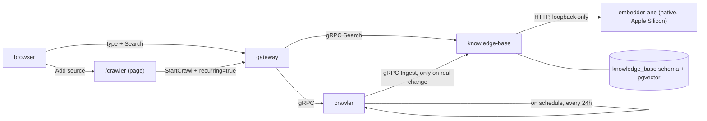

# Knowledge Base Search + Recurring Sources — Design Spec

## Goal

Two user-facing pieces on top of the [knowledge-base design](2026-09-11-knowledge-base-design.md):

1. A search box on Frontend: type text, press Search, get the 10 most relevant `knowledge_base.documents` — ranked by combining embedding similarity, keyword overlap, full-text match, and topic (`page_type`) match.
2. An "Add source" button on Frontend that opens Crawler's existing console. Saving a source there no longer means "crawl once" — it means "crawl this on a schedule": crawl now, then re-crawl once a day, so anything ingested into the knowledge base stays current without a person re-triggering it.

Both depend on [`knowledge-base`'s `Ingest`](2026-09-11-knowledge-base-design.md#proto-knowledge_baseproto-new) already existing, so this spec builds on that one rather than repeating its schema and error-handling rules.

## Why This Is Two Features, One Spec

Search reads `knowledge_base.documents`; recurring crawl is what keeps that table populated and fresh. Shipping search alone against a table nothing ever re-fills would go stale the day after the first crawl; shipping recurring crawl alone with no way to search leaves the data invisible. They ship together because each is half of "the KB is useful without a person babysitting it."

## Data Flow



## Part 1: Search

### Proto: `knowledge_base.proto` (extended)

```protobuf
service KnowledgeBaseService {
  rpc Ingest(IngestRequest) returns (IngestResponse);
  rpc Search(SearchRequest) returns (SearchResponse);
}

message SearchRequest {
  string query = 1;
}

message SearchResult {
  string source = 1;
  string source_id = 2;   // e.g. the original URL, so the frontend can link to it
  string title = 3;
  string summary = 4;
  string page_type = 5;
  float score = 6;         // 0..1, the blended rank below
}

message SearchResponse {
  repeated SearchResult results = 1;   // at most 10, highest score first
}
```

`query` empty is `invalid_argument`, checked once at the entry — same boundary rule as `Ingest`.

### Ranking: Four Signals, One Blended Score

> **Superseded.** This section describes the first Search implementation: one SQL query blending the four signals below with fixed weights. Review found that a weighted sum of uncalibrated scores is brittle and that choosing candidates by text score can never surface a page that is semantically right but shares no vocabulary with the query. Search now runs two retrievers (semantic on HNSW, lexical on GIN) and fuses them by reciprocal rank — see [Search in the design spec](2026-09-11-knowledge-base-design.md#search). The four signals still exist; they are now split between the two retrievers rather than summed.

Every search embeds the query once — via `POST /embed/query` on the native embedder, the same model `Ingest`'s `POST /embed/document` uses, so query and document vectors always come from the same model (see [Embedding Model: Native, Apple Silicon Only](2026-09-11-knowledge-base-design.md#embedding-model-native-apple-silicon-only) for why mixing models is never safe) — and reads the same query as plain text for the other three signals. Keyword, full-text, and topic scoring are all plain Postgres; the embedding call is a loopback HTTP round trip to a process on the same machine (~20 ms on the Neural Engine — see [`embedder-ane`'s README](../../native/embedder-ane/README.md#measured-on-an-m4)), so a search costs one local embedding call and one query, never a call over the internet.

| Signal | Source | Postgres mechanism |
|---|---|---|
| Embedding similarity | `documents.embedding` | pgvector cosine distance (`<=>`), needs the HNSW index this slice adds |
| Full-text | `documents.content`, `documents.title` | `tsvector`/`tsquery`, `ts_rank` |
| Keywords | `documents.keywords` | `&&` (array overlap) against the query's words |
| Topic | `documents.page_type` | exact match when the query names a known type (e.g. "product"); otherwise this signal contributes 0 |

One SQL query computes all four and returns the blend, rather than four queries merged in the service:

```sql
SELECT source, source_id, title, summary, page_type,
       (0.5 * (1 - (embedding <=> $1))
      + 0.25 * ts_rank(to_tsvector('english', title || ' ' || content), plainto_tsquery('english', $2))
      + 0.15 * (CASE WHEN keywords && $3 THEN 1 ELSE 0 END)
      + 0.10 * (CASE WHEN page_type = $4 THEN 1 ELSE 0 END)
       ) AS score
FROM knowledge_base.documents
ORDER BY score DESC
LIMIT 10;
```

Weights (0.5 / 0.25 / 0.15 / 0.10) are a starting point, not a tuned constant — call them out as configurable if real query logs later show embedding similarity alone is enough, or that keyword overlap deserves more weight for short queries.

`$3` (words) and `$4` (topic guess) are derived from `query` in the service layer with plain tokenizing and the same page-type list `Ingest` validates against — no second LLM call to extract them.

### Index

`CREATE INDEX ON knowledge_base.documents USING hnsw (embedding vector_cosine_ops)` — this is the pgvector index the [original spec deferred to Search](2026-09-11-knowledge-base-design.md#schema-knowledge_base); it lands with this slice. A `GIN` index on `to_tsvector('english', title || ' ' || content)` and a `GIN` index on `keywords` back the other two signals; both are new with this slice too, `Index only what you actually query` from [gate-database](../../../.agents/skills/code-review/gate-database/SKILL.md) is satisfied because both are now queried on every search.

### Frontend: Search Box

New page at `GET /search`, served by Frontend the same way `/` is (one static HTML file, `include_str!`, no build step) and proxied by Gateway like every other page route.

- A text input and a "Search" button.
- On click: `POST /knowledge_base.v1.KnowledgeBaseService/Search` with `{query}` at the Connect path, same `fetch` pattern the crawler console already uses.
- Results render as a plain list: title (linking to `source_id` when it looks like a URL), summary, page type, and score — enough to judge relevance, no styling beyond what the crawler console already has.
- Empty results is not an error: render "No matches" rather than treating an empty list as a failure.

### Gateway

`Search` is re-exposed the same way `StartCrawl`/`GetCrawlJob` are today: Gateway holds a `KnowledgeBaseServiceClient`, forwards the call over gRPC, and this is the point where knowledge-base first gets a Gateway client — until now nothing called it from outside crawler. Same 10 s call timeout as the existing crawler client (see [gateway's outbound-timeout rule](../../../services/gateway/README.md)).

## Part 2: Recurring Sources

### What Changes About "Adding a Source"

Today `StartCrawl` means "crawl once, right now." This slice adds a `recurring` flag: when true, the same base URL and scope are re-crawled every 24 hours, forever, until removed. A one-off crawl (`recurring: false`, the default) behaves exactly as today — this is additive, not a breaking change to the existing contract.

### Proto: `crawler.proto` (extended)

```protobuf
message StartCrawlRequest {
  string base_url = 1;
  CrawlScope scope = 2;
  string idempotency_key = 3;
  bool recurring = 4;   // re-crawl this base_url + scope every 24h until removed
}

message StartCrawlResponse {
  string job_id = 1;
  CrawlStatus status = 2;
  string source_id = 3;   // set when recurring=true; empty for a one-off crawl
}

service CrawlerService {
  rpc StartCrawl(StartCrawlRequest) returns (StartCrawlResponse);
  rpc GetCrawlJob(GetCrawlJobRequest) returns (GetCrawlJobResponse);
  rpc ListSources(ListSourcesRequest) returns (ListSourcesResponse);
  rpc RemoveSource(RemoveSourceRequest) returns (RemoveSourceResponse);
}

message ListSourcesRequest {}

message Source {
  string source_id = 1;
  string base_url = 2;
  CrawlScope scope = 3;
  string last_job_id = 4;
  int64 next_crawl_at = 5;   // unix seconds
}

message ListSourcesResponse {
  repeated Source sources = 1;
}

message RemoveSourceRequest {
  string source_id = 1;
}

message RemoveSourceResponse {}
```

`ListSources`/`RemoveSource` exist so the "Add source" page can show what is already recurring and let someone stop one — a source with no way to see or remove it is a source nobody can safely add.

### Schema (`crawler`, extended)

```
sources
  id            bigserial, primary key
  base_url      varchar(2048)  not null
  scope         jsonb          not null   (the CrawlScope, exactly as received — queried only by id, so jsonb is fine here per gate-database's own carve-out for non-queried blobs)
  next_crawl_at timestamptz    not null
  last_job_id   bigint         nullable, references crawl_jobs(id)
  created_at    timestamptz    not null
```

`source_id` in the proto is this row's `id`, formatted the same way `crawl_jobs` ids already are (`format!("source-{id}")`) — consistent with the existing `job-{id}` convention rather than a new id scheme.

### Scheduler

A background task in Crawler, started once at startup alongside the existing `fail_unfinished` sweep:

```
every 5 minutes:
  SELECT * FROM crawler.sources WHERE next_crawl_at <= now()
  for each: start a crawl (same code path StartCrawl already uses), set next_crawl_at = now() + 24h
```

Five minutes, not exactly a day, because "check often, act only when due" is simpler and more crash-safe than scheduling exact one-shot timers per source: a missed tick during a restart is caught by the next one, at most 5 minutes late. This mirrors the existing `PAYLOAD_CLEANUP_INTERVAL` pattern in llm-router — a `tokio::time::interval` loop, not a cron dependency.

Concurrency: a due source's crawl goes through the same `Jobs::run` semaphore ([`MAX_CONCURRENT_CRAWLS`](../../../services/crawler/README.md)) as any other crawl, so recurring crawls cannot starve manually-triggered ones beyond that existing cap.

### Only Real Changes Reach the Knowledge Base

Nothing about `PageStore::save`'s hash comparison or the `Ingest`-on-change rule from the [original spec](2026-09-11-knowledge-base-design.md#data-flow) changes here. A daily re-crawl of an unchanged page still ends at the denoised-hash check, before any `Ingest` call — this slice adds a reason to re-crawl (time), it does not touch why a change does or doesn't propagate to knowledge-base.

### Frontend: Add Source

The existing crawler console (`/`) gains:

- A "Recurring" checkbox next to the existing scope fields, wired to `recurring` on `StartCrawl`.
- A list of current sources below the form: `GET`-equivalent `ListSources` call on page load, showing base URL, next crawl time, and a "Remove" button calling `RemoveSource`.

A new "Add source" button on the **search page** (`/search`) is a plain link to `/` (the crawler console) — no new page, no new component; it reuses the console that already exists rather than duplicating the start-crawl form. This matches the spirit of "one service per capability, in `services/<name>/`" — search stays a knowledge-base concern, adding a source stays a crawler concern, and a link is the whole integration between them.

### Gateway

No change beyond what Part 1 already adds: `StartCrawl`, `ListSources`, and `RemoveSource` are proxied through the same `CrawlerServiceClient` Gateway already holds, since `CrawlerService` is re-exposed as a whole rather than method-by-method.

## Error Handling

- `Search` on an empty `query`: `invalid_argument`, checked once at the entry.
- `RemoveSource` on an unknown `source_id`: `not_found`, matching `GetCrawlJob`'s existing convention.
- A scheduled re-crawl that fails (`Unreachable`, store errors) behaves exactly like any other failed crawl: the job is marked `FAILED`, logged, and `next_crawl_at` still advances by 24h — a source that started failing does not retry every 5 minutes forever; it gets one attempt per day like a healthy source, and a human notices via `ListSources` showing a `last_job_id` that keeps failing.

## Testing

- Ranking SQL: integration test against testcontainers Postgres — seed a handful of documents with known embeddings/keywords/types, assert the blended order matches hand-computed scores for a few queries.
- Scheduler: unit test with a fake clock that a source past `next_crawl_at` triggers exactly one crawl and advances the timestamp; a source not yet due does not.
- `ListSources`/`RemoveSource`: standard CRUD-shaped tests against testcontainers Postgres, same pattern as `crawl_jobs`.
- Frontend: manual check only, consistent with how the existing crawler console is tested (no browser test harness in this repo yet).

## Out of Scope for This Slice

- Configurable recurrence interval (always 24h; a per-source interval is a later slice if someone needs it).
- Search filters in the UI (date range, source, explicit topic dropdown) — the query box is the only input.
- Pagination past the top 10 results.
- Tuning the four ranking weights against real usage data.
- Auth on `RemoveSource` — anyone who can reach the crawler console can remove any source, same trust level as `StartCrawl` today.
